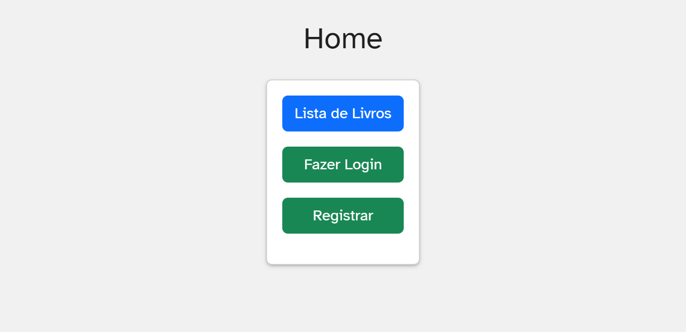
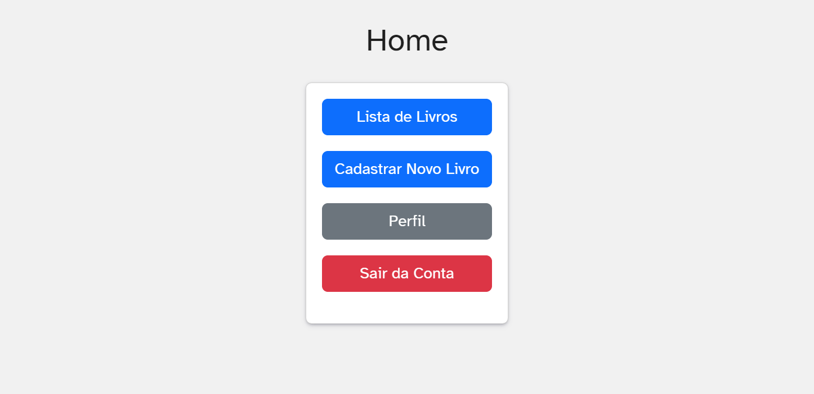
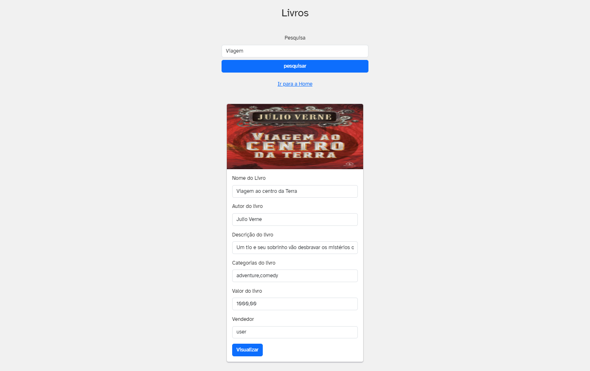
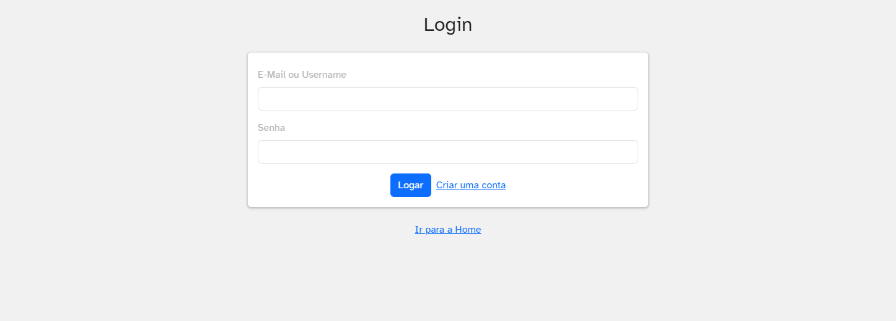
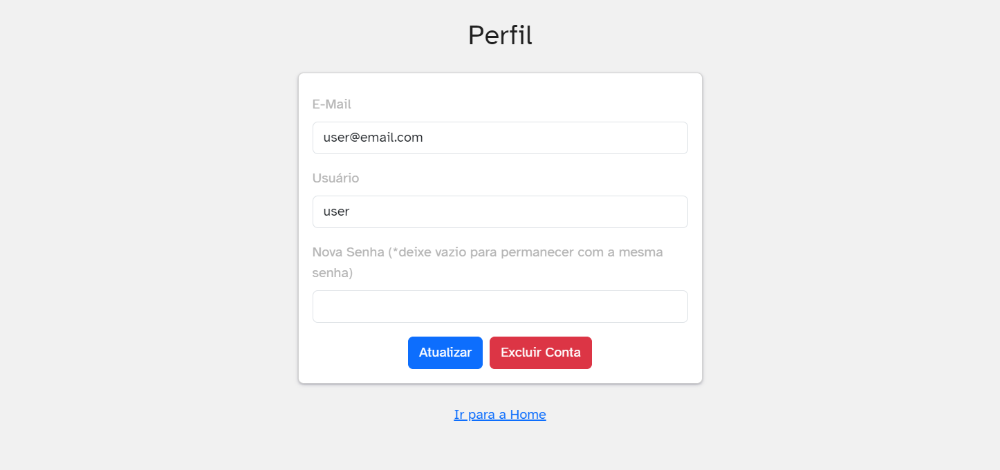
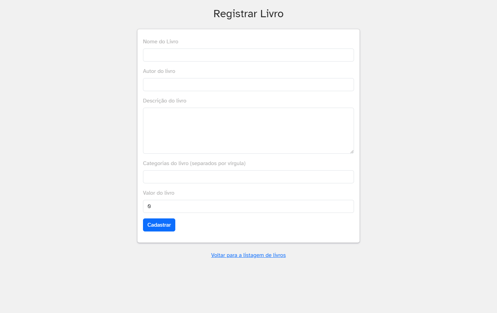
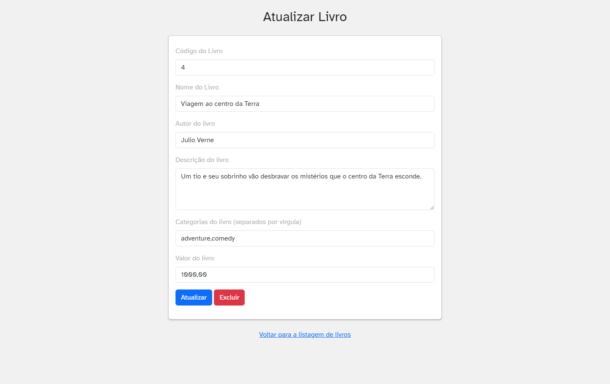

# Projeto-Ecommerce
Projeto em PHP para construção de um E-commerce sob a matéria de Padrões de Projeto.

## How to run

- Clone the project `git clone https://github.com/sowinghustle/Projeto-Ecommerce.git projeto-ecommerce`.
- Enter the project folder.
- Execute the project with docker `docker compose up -d --build`.
- The website will be running on http://localhost:80/.
- The PhpMyAdmin service will be avaible on http://localhost:8000/.

## Overview

### Home Page

### Search Books Page

### Login and Signup Page

### Profile

### Create and Update Book

